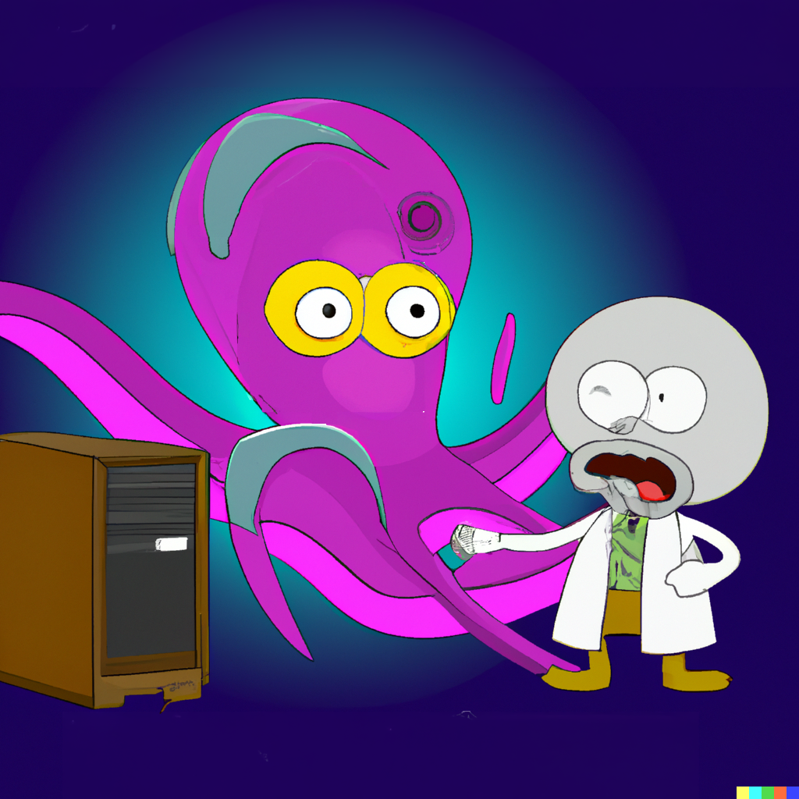

# Detextify

## What is this?

**TL;DR**: A Python library to remove unwanted pseudo-text from images generated by your favorite generative AI models (Stable Diffusion, Midjourney, DALL·E).

| Before                      | After                                  |
|-----------------------------|----------------------------------------|
|  |  |

## So, why should I care?

We all know generative AI is the coolest thing since sliced bread 🍞.

But try using any off-the-shelf generative vision model and you'll quickly see that these systems can get... creative with interpreting
your prompts.

Specifically, you'll observe all kinds of weird artifacts on your images from extra fingers on hands, to arms coming out of chests,
to alien text written in random places.

For generative systems to actually be usable in downstream applications, we need to better control these outputs
and mitigate unwanted effects.

We believe the next frontier for generative AI is about **robustness** and **trust**. In other words, how can we architect
these systems to be controllable, relevant, and predictably consistent with our needs?

`Detextify` is the first phase in our vision of robustifying generative AI.

If we get this right, we will unlock slews of new applications for generative systems that will change the landscape of human-AI collaboration. 🌎

## Cute, but what are you actually doing?

`Detextify` runs text detection on your image, masks the text boxes, and in-paints the masked regions
until your image is text-free. `Detextify` can be run entirely on your local machine (using
[Paddle](https://github.com/PaddlePaddle/PaddleOCR) for text detection and
[Stable Diffusion](https://huggingface.co/stabilityai/stable-diffusion-2-inpainting) for in-painting), or can call existing APIs
([Azure](https://azure.microsoft.com/en-us/products/cognitive-services/computer-vision/) for text detection and
[OpenAI](https://openai.com/dall-e-2/) or [Replicate](https://replicate.com/) for in-painting).

## Installation
```commandline
# On a GPU-enabled machine
pip install paddlepaddle-gpu -i https://mirror.baidu.com/pypi/simple
pip install detextify
```

```commandline
# On a CPU-only machine
pip install paddlepaddle -i https://mirror.baidu.com/pypi/simple
pip install detextify
```

## Usage

You can remove unwanted text from your image in just 5 lines 💪:
```python
from detextify.paddle_text_detector import PaddleTextDetector
from detextify.inpainter import LocalSDInpainter
from detextify.detextifier import Detextifier

detextifier = Detextifier(PaddleTextDetector(), LocalSDInpainter())
detextifier.detextify("/my/input/image/path.png", "/my/output/image/path.png")
```

and 💣💥, just like that, your image is cleared of any bizarre text artifacts.

Or if you want to clean up a directory of PNG images, just wrap it in a for-loop:
```python
import glob
from detextify.paddle_text_detector import PaddleTextDetector
from detextify.inpainter import LocalSDInpainter
from detextify.detextifier import Detextifier

detextifier = Detextifier(PaddleTextDetector(), LocalSDInpainter())
for img_file in glob.glob("/path/to/dir/*.png"):
    detextifier.detextify(img_file, img_file.replace(".png", "_detextified.png")
```

We provide multiple implementations for text detection and in-painting (both local and API-based), and you are also free to add your own.

### Text Detectors
1. `PaddleTextDetector` (based on [PaddleOCR](https://github.com/PaddlePaddle/PaddleOCR)) runs locally.
2. `AzureTextDetector` calls a computer vision API from Microsoft Azure. You will first need to create a
[Computer Vision resource](https://portal.azure.com/#create/Microsoft.CognitiveServicesComputerVision) via the Azure
portal. Once created, take note of the endpoint and the key.
```python
AZURE_CV_ENDPOINT = "https://your-endpoint.cognitiveservices.azure.com"
AZURE_CV_KEY = "your-azure-key"
text_detector = AzureTextDetector(AZURE_CV_ENDPOINT, AZURE_CV_KEY)
```
Our evaluation shows that the two text detectors produce comparable results.

### In-painters
1. `LocalSDInpainter` (implemented via Huggingface's `diffusers` library) runs locally and requires a GPU. Defaults to
[Stable Diffusion v2 for in-painting](https://huggingface.co/stabilityai/stable-diffusion-2-inpainting).
2. `ReplicateSDInpainter` calls the [Replicate](https://replicate.com) API. Defaults to Stable Diffusion v2 for
in-painting (and requires an API key).
3. `DalleInpainter` calls the [DALL·E 2](https://labs.openai.com) API from OpenAI (and requires an API key).
```python
# You only need to instantiate one of the following:
local_inpainter = LocalSDInpainter()
replicate_inpainter = ReplicateSDInpainter("your-replicate-key")
dalle_inpainter = DalleInpainter("your-openai-key")
```

## Contributing
To contribute, clone the repository, make your changes, commit and push to your clone, and submit a pull request.

To build the library, you need to install [poetry](https://python-poetry.org/):
```commandline
curl -sSL https://install.python-poetry.org | python3 -
# Add poetry to your PATH. Note the specific path will differ depending on your system.
export PATH="/home/ubuntu/.local/bin:$PATH"
# Check the installation was successful:
poetry --version
```
Install dependencies for `detextify`:
```commandline
poetry install
```
To execute a script, run:
```commandline
poetry run python your_script.py
```
Please run the unit tests to make sure that your changes are not breaking the codebase:
```commandline
poetry run pytest
```

## Authors
This project was authored by [Mihail Eric](https://twitter.com/mihail_eric) and [Julia Turc](https://twitter.com/juliarturc). If you are building in the generative AI space, we want to hear from you!
